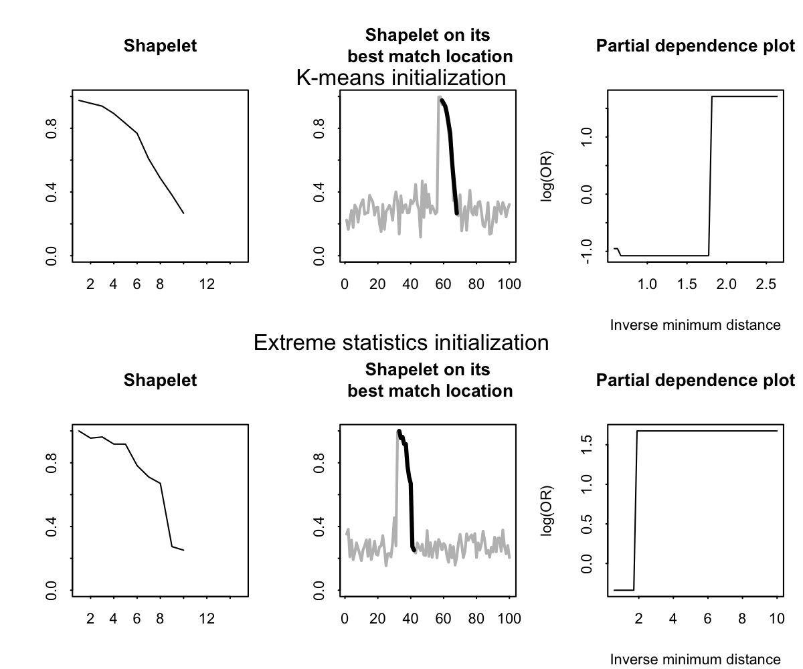

# Introduction

This repository contains R files that implement the Shapelet method in R. 

# Reference 
This repository is from the paper: Shapelet-based time-series classification for relating daily asthma control to highly time-resolved residential indoor PM2.5 measurements"

# Content
This repository contains two R files: 
1. ShapeletFunc: Functions that search for and evaluate shapelets 
2. Example: Example code to simulate time series with unique shapes and run the shapelet analysis

# An explanation of the example 
We simulated 100 observations of length 100 of mean of 0 and standard distribution of 1. We inserted a shape of length 10 to 70% of the time series. The time series with the shape have a probability of 0.95 of having the outcome; the time series without the shape have a probabilty of 0.05. 

We used our proposed shapelet methods (K-means and extreme statistics) to search for and evaluate the shapelets. 

We presented the most important shapelet, its best matched location, and its assocation with the outcome using the partial depdence plot. 

# Versions of R and Package  
R version\
4.0.1

Packages\
xgboost_1.1.1.1 
pdp_0.7.0 
zoo_1.8-8     
plyr_1.8.6    
dplyr_1.0.0   
pROC_1.16.2   
TSPred_4.0   
rdist_0.0.5  
